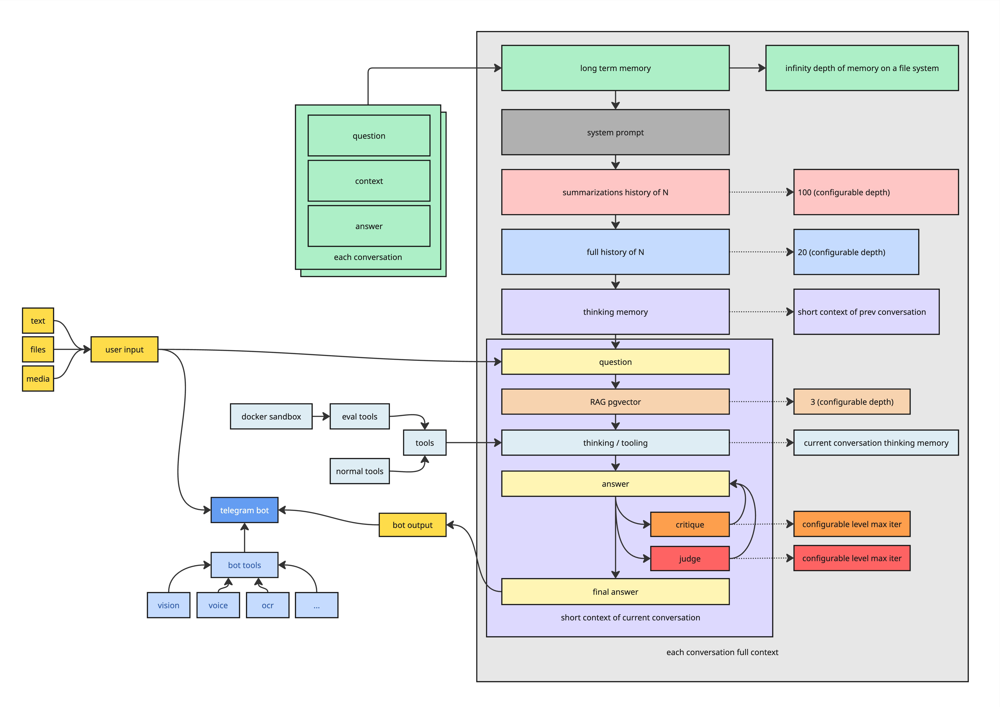

# 🤖 GALL.AI (prev. GenerALL.AI) - Multimodal Gen AI Agent System

> **Note:** GenerALL.AI refers to a "General Purpose AI", not a military general.

## 📋 Overview

GALL.AI (General AI) is a sophisticated multimodal agent system with telegram bot communication interface powered by advanced AI models like Claude 3.7 Sonnet and GPT-4o. It provides a seamless interface for users to interact with AI capabilities through Telegram, supporting text, voice, images, documents, and more.

## 🔎 At a Glance

- **Multimodal Agent System**: Process and respond to text, voice, images, and documents within a single conversation
- **Tool-Based Architecture**: Powered by specialized modules for tasks like web search, file operations, code execution, and more
- **Extensible Framework**: Built on a modular system that can be expanded with new capabilities
- **Natural Interface**: Communicate with advanced AI models through the familiar Telegram messaging platform
- **Secure Execution**: All operations run in isolated environments with proper permission controls

## ✨ Features

- **🔄 Multimodal Support**: Process and respond to text, voice messages, images, PDFs, and other document types
- **🎤 Voice Processing**: Transcribe voice messages and generate voice responses with customizable voices via ElevenLabs
- **🖼️ Image Analysis**: Describe and analyze images using state-of-the-art vision models
- **📸 Multiple Photo Processing**: Analyze multiple images simultaneously to describe, compare differences, and redraw content
- **🎨 Image Generation**: Create new images based on text descriptions or modifications of existing images
  - **🔄 Generate with DALL-E 3**: Create single images with OpenAI's DALL-E 3 model
  - **✨ Multimodal Generation with Gemini**: Generate stories with matching images using Google's Gemini model
  - **🖌️ Image-to-Image Transformation**: Edit and transform existing images with powerful AI editing capabilities
- **📄 Document Processing**: Extract and analyze content from PDFs and other documents with deep understanding of the content
- **⏰ Reminder System**: Create and manage reminders with natural language processing for both specific times and contextual events
- **📅 Task Scheduling**: Schedule tasks to execute based on specific times or event triggers like "after a match ends"
- **🔒 Secure Container System**: Run unsafe commands in isolated Docker containers
- **💻 Terminal Access**: Execute system commands securely through the bot interface
- **📦 Package Management**: Install and run packages in a secure containerized environment
- **📁 File Sharing**: Send files directly to users through Telegram
- **📱 SMS Messaging**: Send SMS text messages to phone numbers via Twilio integration
- **⚙️ Customizable Settings**: Fine-tune the assistant's behavior through an interactive settings menu
- **🧠 Persistent Memory**: Maintain conversation context across sessions
- **🔌 Advanced Agent Architecture**: Powered by a modular agent system with specialized tools for different tasks
- **💾 Memory Management**: Smart conversation history handling with summarization capabilities
- **🔍 Web Search**: Search the web for up-to-date information using multiple providers (Perplexity, Tavily)
- **🧩 Reasoning Systems**: Multiple stages of reasoning with critique and judge mechanisms
- **☁️ Cloud Storage**: Upload and manage files on S3-compatible storage
- **💻 Code Execution**: Write and execute Python and Bash scripts in secure environments
- **💬 In-Process Communication**: Send Telegram messages, files, or reactions directly during thinking operations through tool-based interactions, not just as final bot output
- **🔒 SSH Connections**: Securely connect to remote servers via SSH to perform system administration tasks and retrieve information
- **🔍 Shodan API Integration**: Leverage Shodan's powerful internet scanning capabilities to gather intelligence on networks, devices, and potential security issues
- **🛠️ Advanced Tools & Techniques**: Utilize specialized cybersecurity, networking, and data analysis tools for comprehensive assessments and operations
- **🎟️ Invite System**: Control access through user invites with admin oversight
  - Users can create and share limited invite codes (5 per user)
  - Admins have unlimited invite generation capability
  - Track invite usage and user access via admin commands
  - Automatically notify admins when new users join

## ⚙️ How memory work



- Control all memory aspect
- Long term memory
- Short term memory
- Previous conversation full thinking context
- RAG automated memory
- Summarization memory

## 🚀 Example Scenarios

Here are some advanced scenarios that demonstrate the power and versatility of GenerALL.AI:

### 📊 Deep Research with File Export

```
User: "Research the latest developments in quantum computing in 2023-2024. Save the results as a PDF and send it to me."

Bot: "I'll research the latest developments in quantum computing and prepare a comprehensive report for you."
     [Conducts research using Perplexity and Tavily integrations]
     [Generates a structured report in Markdown format]
     [Converts to PDF]
     [Uploads to S3 storage]
     [Sends file to user via Telegram]
     "Here's your research report on quantum computing advancements in 2023-2024. I've included sections on hardware breakthroughs, algorithm developments, and industry applications."
```

### 🖥️ Remote Server Management

```
User: "Connect to my production server at ssh://user@example.com and check disk usage on all volumes."

Bot: "I'll connect to your production server and check the disk usage."
     [Establishes secure SSH connection]
     [Executes df -h command]
     [Formats results in a readable table]
     "Here's the current disk usage on your production server:
      Filesystem    Size    Used    Avail   Use%    Mounted on
      /dev/sda1     50G     23G     25G     48%     /
      /dev/sdb1     1T      750G    230G    77%     /data"
```

### 🔍 Security Vulnerability Scanning

```
User: "Scan my website https://example.com for common security vulnerabilities."

Bot: "I'll perform a security scan of your website. This might take a few minutes."
     [Sets up a secure container for scanning]
     [Installs and runs security tools]
     [Analyzes results and compiles a security report]
     "I've completed the security scan of your website. I found:
      - 2 potential XSS vulnerabilities in your contact form
      - Outdated SSL certificate (expires in 15 days)
      - Missing HTTP security headers
      I've attached a detailed report with recommendations for fixing these issues."
```

### 🎨 Advanced Image Generation and Transformation

```
User: "Create a story about a space explorer discovering an ancient alien civilization. Include images for each key scene."

Bot: "I'll create a multimodal story about a space explorer discovering an ancient alien civilization."
     [Generates a complete story with matching images for each key scene]
     [Sends text and images together in a coherent narrative]
     "The Stellar Archaeologist - A space explorer's journey to the lost civilization of Proxima Centauri IV..."
     [Image of a space explorer approaching an alien planet]
     "As Captain Elara approached the crystalline structures, their surfaces shimmered with an otherworldly light..."
     [Image of alien crystal structures with mysterious glowing patterns]
     
User: "This is great! Can you transform the second image to add more alien symbols and make it look more mysterious?"

Bot: "I'll transform that image to add more alien symbols and enhance the mysterious atmosphere."
     [Takes the existing image and applies the requested transformations]
     [Sends the modified image with new alien symbols and enhanced mysterious elements]
     "Here's the transformed image with additional alien symbols and a more mysterious atmosphere. I've added ancient hieroglyphs that glow with an eerie blue light and enhanced the shadowy elements to create a sense of the unknown."
```

### ⏱️ Complex Event-Based Reminders

```
User: "Monitor the NASA website and alert me when the next SpaceX launch is scheduled. Remind me 1 day before and again 1 hour before the launch."

Bot: "I'll monitor the NASA and SpaceX websites for upcoming launch information and set up the reminders for you."
     [Sets up regular monitoring of relevant websites]
     [Identifies next launch date]
     [Creates two context-based reminders]
     "I've set up monitoring for the next SpaceX launch. Currently, the next launch is scheduled for June 15th at 3:00 PM EDT. I'll remind you on June 14th at 3:00 PM and again on June 15th at 2:00 PM."
```

### 👨‍💻 Custom Code Development and Execution

```
User: "Write a Python script that analyzes a CSV file of stock prices, calculates moving averages, and generates a visualization. Use pandas and matplotlib."

Bot: "I'll create a Python script for stock price analysis with moving averages visualization."
     [Writes Python code using pandas and matplotlib]
     [Installs required libraries in a secure container]
     [Executes the code with sample data]
     [Generates visualization]
     [Sends the resulting graph and script file to the user]
     "I've created and executed a stock analysis script that:
      1. Loads CSV data using pandas
      2. Calculates 7-day and 30-day moving averages
      3. Generates a visualization with original prices and both moving averages
      4. Highlights potential buy/sell signals
      
      I've attached both the visualization and the Python script. You can modify the script 
      to use your own data by changing the file path in line 12."
```

### 🎟️ Invite-Based Access Control

```
User: "/invite"

Bot: "🎟️ New Invite Created

Share this link: https://t.me/YourBotName?start=invite_a1b2c3d4

Or use this command:
/invite a1b2c3d4

Invites remaining: 4/5"

[Later, when someone uses the invite]

New User: "/start invite_a1b2c3d4"

Bot: "✅ Invite accepted! You now have access to the bot.
     
     👋 Welcome to Generall.AI bot! Use me to get AI assistance.
     
     You can send me messages, voice recordings, or images to analyze."

[Admin receives notification]

Bot to Admin: "🔔 New user joined!
               User ID: `123456789`
               🌟 Invited by: `987654321`
               🌟 Total users: 3"
```

## 🔄 Advanced Features

### 🎤 Voice Settings
Customize voice parameters including voice model selection, stability, clarity, and style. The bot can both listen to your voice messages and respond with generated voice using ElevenLabs.

### 📄 PDF Processing
Upload PDFs to extract and analyze content. The bot can understand complex documents, summarize contents, answer questions about the document, and provide insights.

### 🎨 Advanced Image Generation and Transformation

GenerALL.AI offers multiple powerful image generation and transformation capabilities:

#### 📸 DALL-E 3 Image Generation
Generate high-quality single images with OpenAI's DALL-E 3 model, with customizable parameters:
- Control image size and quality
- Detailed prompt capabilities
- Supports art styles, photography styles, and concept visualization

#### ✨ Multimodal Generation with Gemini
Create rich stories with matching images using Google's advanced Gemini model:
- Generate text and images simultaneously within a single cohesive experience
- Create multiple images that match the narrative flow
- Support for various artistic styles (3D digital art, photorealistic, cartoon, anime, etc.)
- Perfect for storytelling, educational content, and creative projects

#### 🖌️ Image-to-Image Transformation
Transform and edit existing images with AI:
- Add or remove elements from images
- Change styles, colors, or artistic approaches
- Apply creative modifications based on text instructions
- Useful for design iterations, creative exploration, and visual problem-solving
- Works with images the user has sent previously

### 📁 Supported Text File Types
GenerALL.AI supports processing and analysis of various file formats including:
- **Documents**: PDF, TXT, DOCX, MD
- **Data Files**: JSON, JSONL, CSV, XLSX, XLS
- **Code Files**: PY, JS, HTML, CSS, PHP, SQL
- **Configuration Files**: XML, YAML, YML, TOML, INI, CONF
- **Shell Scripts**: SH, BAT, PS1
- **System Files**: LOG

The bot can extract content, analyze structure, and help you understand the information contained within these supported file types.

### 🎬 Supported Media File Types
GenerALL.AI supports processing and analysis of various media formats including:
- **Images**: JPG, JPEG, PNG, GIF*, BMP*, WEBP*
- **Audio**: Telegram Voice Message, mp3*, ogg*
- **Video**: -/-

The bot can:
- **Images**: Analyze content, detect objects, read text (OCR), and describe scenes
- **Audio**: Transcribe speech, analyze audio content, and detect language and answer using voice generation
- **Video**: -/-


### 💻 Code Execution Capabilities
- **🐍 Python Development**: Create, edit, and execute Python scripts in a secure environment
- **🔧 Bash Scripting**: Run Bash scripts and system commands safely
- **📦 Package Installation**: Install Python libraries and dependencies as needed
- **📊 Data Analysis**: Process and visualize data with popular libraries like pandas, numpy, and matplotlib
- **🔁 Automated Workflows**: Create scripts for repetitive tasks and automated data processing
- **🔒 Secure Execution**: All code runs in isolated containers for security
- **📋 Code Editing**: Iteratively improve code based on requirements and feedback

### ⏰ Reminder and Task System

## 💻 System Requirements

### 🛠️ For Local Development

- Python 3.12+
- Docker and Docker Compose
- FFmpeg (for audio processing)
- Git

### 🔑 API Keys Required

- Telegram Bot Token
- Anthropic API Key (for Claude 3.7)
- OpenAI API Key (for GPT-4o and Whisper)
- ElevenLabs API Key (for voice synthesis)
- Google API Key (for Gemini image generation/transformation)

## 📥 Installation

### 🐳 Using Docker (Recommended)

1. Clone the repository:
   ```bash
   git clone https://github.com/your-username/generall.ai.git
   cd generall.ai
   ```

2. Create an `.env` file based on the provided `.env.example`:
   ```bash
   cp .env.example .env
   ```

3. Edit the `.env` file with your API keys and configuration.

4. Build and start the Docker container:
   ```bash
   docker-compose up --build
   ```

### 🔧 Manual Installation

1. Clone the repository:
   ```bash
   git clone https://github.com/your-username/generall.ai.git
   cd generall.ai
   ```

2. Create and activate a Python virtual environment:
   ```bash
   python -m venv .venv
   source .venv/bin/activate  # On Windows: .venv\Scripts\activate
   ```

3. Install the dependencies:
   ```bash
   pip install -r app/requirements.txt
   ```

4. Create and configure your `.env` file.

5. Install FFmpeg system-wide or use the included ffmpeg-downloader.

6. Run the bot:
   ```bash
   python app/main_bot.py
   ```

## 🔄 Compatibility

- **💻 Operating Systems**: Linux (recommended for production), macOS, Windows
- **🚀 Deployment**: Docker-based deployment supported across all major platforms
- **🐍 Python Version**: 3.12+ required
- **🖥️ Hardware Requirements**: 
  - Minimum: 4GB RAM, 2 CPU cores
  - Recommended: 8GB+ RAM, 4+ CPU cores (especially for handling multiple conversations)
- **🌐 Network**: Requires internet connection for API access

## ⚙️ Configuration

The application is configured via environment variables in the `.env` file. Key configuration options include:

### 🔑 API Keys

- `ANTHROPIC_API_KEY`: API key for Anthropic Claude models
- `OPENAI_API_KEY`: API key for OpenAI GPT models
- `GOOGLE_API_KEY`: API key for Gemini AI models
- `OPENAI_API_KEY_WHISPER`: API key for OpenAI Whisper (voice transcription)
- `TAVILY_API_KEY`: API key for Tavily search integration
- `PERPLEXITY_API_KEY`: API key for Perplexity search integration
- `ELEVENLABS_API_KEY`: API key for ElevenLabs voice synthesis

### 🤖 Telegram Configuration

- `TELEGRAM_BOT_TOKEN`: Your Telegram bot token from BotFather
- `TELEGRAM_CHAT_ID`: Comma-separated list of initially allowed Telegram chat IDs
- `TELEGRAM_ADMIN_ID`: Telegram chat ID for the admin user (has unlimited invites and can list all users)

### 🧠 Agent Configuration

- `MAX_AGENT_TOOLS_ITERATIONS`: Maximum number of tool use iterations (default: 65)
- `MAX_AGENT_CRITIQUE_ITERATIONS`: Maximum number of critique iterations (default: 0)

### ☁️ S3 Storage Configuration

- `S3_HOST`: S3-compatible storage host URL
- `S3_ACCESS_KEY`: S3 access key for authentication
- `S3_SECRET_KEY`: S3 secret key for authentication
- `S3_BUCKET_NAME`: Name of the S3 bucket to use
- `S3_PATH_TO_STORE`: Path within the bucket to store files

### 📱 Twilio Configuration

- `TWILIO_ACCOUNT_SID`: Twilio account SID for SMS messaging
- `TWILIO_AUTH_TOKEN`: Twilio authentication token
- `TWILIO_FROM_NUMBER`: Twilio phone number to send messages from

## 🔐 Security Considerations

- The application uses secure Docker containers to run potentially unsafe commands
- User access is restricted to specified Telegram chat IDs
- API keys are stored securely in environment variables
- Docker socket is mounted to allow container management

## 📝 Usage

1. Start a conversation with your bot on Telegram
2. Send text messages, voice recordings, images, or documents
3. The bot will process your input and respond accordingly
4. Use `/settings` to customize the bot's behavior
5. Use `/reminders` to manage your reminders

## ❓ Troubleshooting

- **🤖 Bot not responding**: Check your Telegram token and allowed chat IDs
- **🎤 Voice features not working**: Ensure FFmpeg is properly installed
- **🐳 Container issues**: Verify Docker is running and the user has appropriate permissions
- **🔑 API errors**: Check your API keys and network connection

## 📄 License

GenerALL.AI is released under a custom license with the following terms:

- ✅ **Personal Use**: You may use this software for personal, non-commercial purposes.
- ✅ **Modification**: You may modify the software and create derivative works.
- ✅ **Distribution**: You may distribute copies of the original or modified software.
- ✅ **Attribution**: You must give appropriate credit to the original authors.
- ❌ **Commercial Use**: Commercial use requires explicit permission from the copyright holders.

See the [LICENSE](./LICENSE) file for complete details.

## 👏 Acknowledgments

- Built with [python-telegram-bot](https://github.com/python-telegram-bot/python-telegram-bot)
- Uses AI models from Anthropic and OpenAI
- Voice synthesis powered by ElevenLabs 


## ❤️ Donation:

Become a Patron: https://www.patreon.com/zorg
Donate via Paypal: http://paypal.me/mezorg/15

##### ₿ BTC:

`bc1qyymy3ufvq3c3uq2q4927ll6x4rhvdw8gxlydwc`

##### Ξ ETH:

`0x0213A705065B193D14f1A3cd075977e28Da8F9B3`

##### 💵 USDT-TRC20:

`TG2efcamZ1767TkBfeGUn8QWaRGrLpHUxD`

##### 💵 SOL:

`B7faayiFUqM64Dgt4iUtpSfWbo4VANBs8bknSXv3e53E`

##### 💎 TON:

`UQDg07heLBcWdYO_sP6_Hc9hCu24E3v05sBJuRqc_DyWKreq`

##### 🐕 DOGE:

`D9RbkgazaGhkT4FHkJtHoh4hDxkzAZwQnK`


You can make a donation / subscription, or say thanks in Telegram: https://t.me/ZorgeR

Boosty (Donate / Subscription) : https://boosty.to/zorgg
